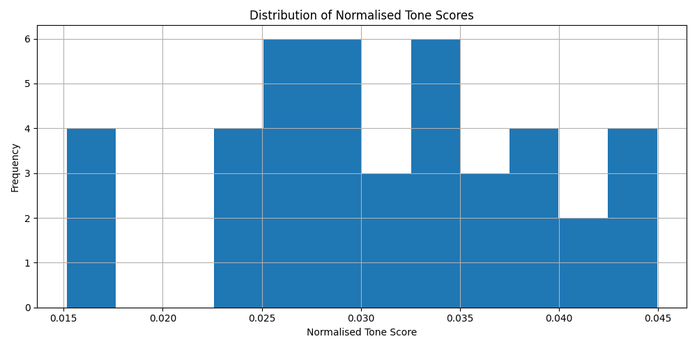
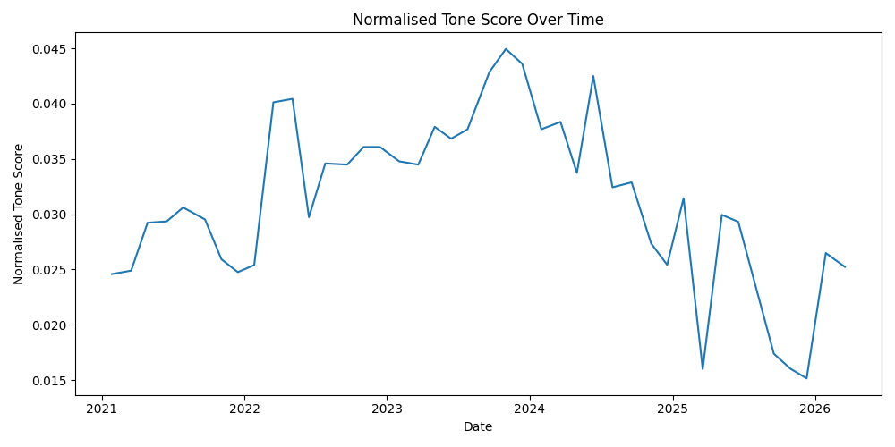
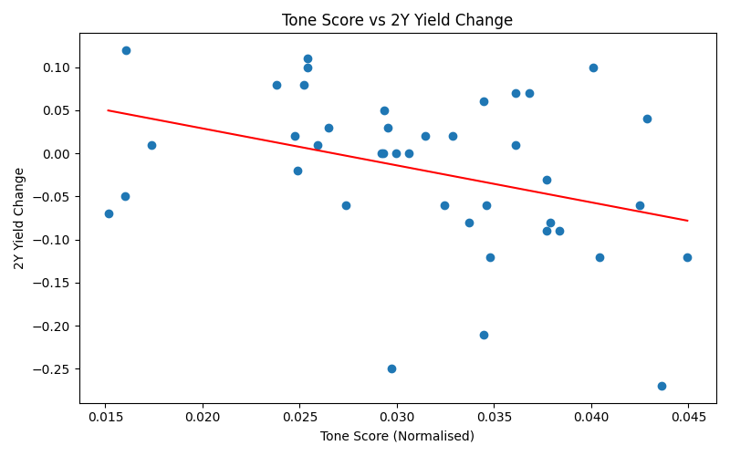
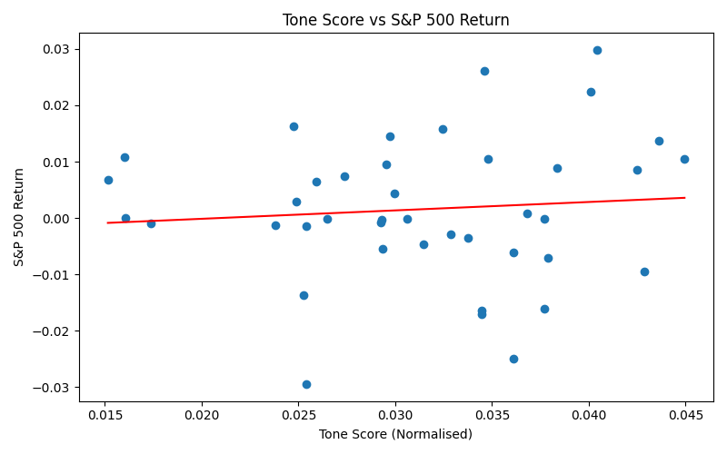
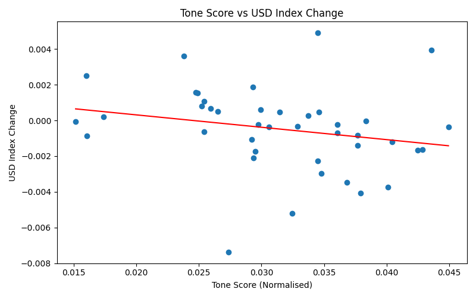

# Introduction

Central bank communication matters because markets respond not only to policy decisions, but also to how policymakers describe inflation, growth, and risks.

This post studies whether the tone of Federal Reserve policy statements is associated with short-term moves in Treasury yields, the US dollar, and equities.

# Research Question

Do more hawkish Federal Reserve statements correspond to changes in short-term market reactions?

# Data

This project combines:
- Federal Reserve policy statements
- Daily market data for 2-year Treasury yields, the S&P 500, and a US dollar index

# Method

I scraped Federal Reserve statements, cleaned the text, built a simple hawkish-dovish tone score, and merged statement dates with daily market movements.

I then estimated both:
- a baseline tone-level specification
- a tone-change specification comparing each statement to the previous one

# Results

## Tone distribution

## Tone over time

## Baseline tone and 2Y yield change

## Baseline tone and S&P 500 return

## Baseline tone and USD index change

# Interpretation

The baseline specification produces the clearest relationship for 2-year Treasury yield changes, although the sign is negative rather than expected. A change-based tone specification produces a more economically intuitive sign, but weaker statistical significance.

This suggests that statement wording may contain information relevant for short-term rates, but that a simple dictionary-based text measure remains an imperfect proxy for policy surprise.

# Limitations

This project has several limitations:
- the text measure is deliberately simple
- FOMC statements contain repeated boilerplate
- same-day market reactions may reflect broader interpretation than statement wording alone
- the sample size is relatively small

# Conclusion

A simple text-based measure of FOMC statement tone appears to relate most clearly to short-term Treasury yield reactions, while the evidence for equities and the dollar is weaker.

The comparison between level-based and change-based specifications suggests that markets may respond more to changes in language than to the absolute level of tone.